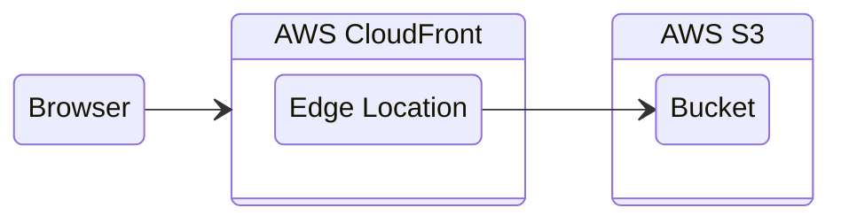

# Paprika Outlook

> Send Anywhere Add-in for Office 365 Outlook

## Prerequisites
- Node version: 18.18.2, if not installed, run nvm install 18.18.2
- This project uses [pnpm](https://pnpm.io/). If not installed, run npm install -g pnpm
- Custom add-ins uploaded to web and desktop applications. 
    - To upload add-ins, please refer to [Upload add-ins to desktop application](#upload-add-ins-to-desktop-application) and [Upload add-ins to web application](#upload-add-ins-to-web-application) below
    - Different files need to be uploaded for each desired environment. See table below.
      
  
        | Desired Environment | manifest.xml file to be uploaded |
        | -------- | -------- |
        | Local Development    | /manifest.xml     |
        | Test    | /manifest/manifest-test.xml     |
        | Test-Biz    | /manifest/manifest-test-biz.xml     |
        | Staging    | /manifest/manifest-staging.xml     |
        | Staging-Biz    | /manifest/manifest-staging-biz.xml     |

    ### Upload add-ins to desktop application
    
    1. Open your Outlook Desktop Application
    3. Click `···` button on the top menu bar
    4. Click `Get Add-ins` button
    5. Click `My Add-ins` button on the left side menu
    6. Scroll down to click `+ Add to Outlook` button
        - Click `Add from File...` button
    7. Upload `manifest*.xml` file corresponding to desired environment. This is specified in [Prerequisites](#prerequisites).
      
    ### Upload add-ins to web application
    
    1. In your preferred browser, go to https://aka.ms/olksideload to open the Add-Ins for Outlook dialog
    2. Select `My add-ins`
    3. In the Custom Addins section, select Add a custom add-in, then choose `Add from file`
    4. Upload `manifest*.xml` file corresponding to desired environment. This is specified in [Prerequisites](#prerequisites).

## Installation
- run `pnpm install` after cloning this repository

## Run in local development environment

1. Run [**PAPRIKA WEB**](https://github.com/Rakuten-MTSD-PAIS/paprika_web) dev server locally.
    Run `pnpm run --filter @app/server dev:local` (from root directory of paprika web)

2. Run `pnpm dev-server` from root directory of [**PAPRIKA_OUTLOOK**](https://github.com/Rakuten-MTSD-PAIS/paprika_outlook), which is **THIS** project you're working on.

3. Follow one of the instructions that suits your desired task.

###    **To test in your Outlook Desktop Application**

- If you satisfied prerequisites and custom add-in is successfully added, you can see `localhost Send Anywhere` button on clicking `···` button on the top menu bar when writing an email

###    **To test in your Outlook Web Application**
    
- If you satisfied prerequisites and custom add-in is successfully added, you can see `localhost Send Anywhere` button on clicking `···` button on the top menu bar when writing an email
- You can debug with developer tools on your browser.

- **To test bare React.js app in web browser**

    - Visit "https://localhost:3000/outlook.html"

## Run in test, staging environment
Follow one of the instructions below that suits your desired task.

###     **To test in your Outlook Desktop or Web Application**
- If you satisfied prerequisites and custom add-in is successfully added, you can see `Test(or Staging) Send Anywhere` button on clicking `···` button on the top menu bar when writing an email

###     **To test React.js app in web browser**
- Visit https://test.send-anywhere.com/web/outlook/ for test environment
- Visit https://web-staging.send-anywhere.com/web/outlook/ for staging environment

## Build
- Run `pnpm build` to build in production mode.
- Run `pnpm build:dev` to build in development mode.

## Deployment
Please refer to github actions in root `.github/workflows/**`

### AWS Architecture
The diagram displays an overview of the AWS architecture. The files of ReactJS SPA web application are hosted in an S3 bucket, which is accessed by Cloudfront.

### Deployment Scripts

Refer to github actions in root `.github/workflows/**`

#### Project Actions

- `develop.yml` **develop** branch default workflow
- `staging.yml` **staging** branch default workflow
- `production.yml` **production** branch default workflow
- `deployment.yml` **develop** branch deployment workflow
- `build.yml` default build workflow

## Notes
- According to [Outlook Add-in Docs](https://learn.microsoft.com/en-us/office/dev/add-ins/quickstarts/outlook-quickstart?tabs=yeomangenerator), Office Add-ins should use HTTPS, not HTTP, even while you're developing. So please make sure that you're using **HTTPS** protocol, not HTTP. Otherwise, you will not be able to test the add-in.
    - Please refer to `./webpack.config.js` for https configuration in development environment.

- Every feature of send-anywhere Outlook add-in works properly inside Outlook web/desktop application.
    - If only the react app is tested in web browser, it will not work properly.
    - For example, if you visit https://send-anywhere.com/web/outlook/ in web browser, social login will not work.

- Adding add-ins to Outlook web application seems to be not supported as of now.

## References
- [Using add-ins in Outlook on the web](https://support.microsoft.com/en-us/office/using-add-ins-in-outlook-on-the-web-8f2ce816-5df4-44a5-958c-f7f9d6dabdce)
- [Sideload Office Add-ins in Office on the web for testing](https://docs.microsoft.com/en-us/office/dev/add-ins/testing/sideload-office-add-ins-for-testing)
- [Sideload Office Add-ins on Mac](https://learn.microsoft.com/en-us/office/dev/add-ins/testing/sideload-an-office-add-in-on-mac)
- [office-addin-debugging](https://www.npmjs.com/package/office-addin-debugging)
